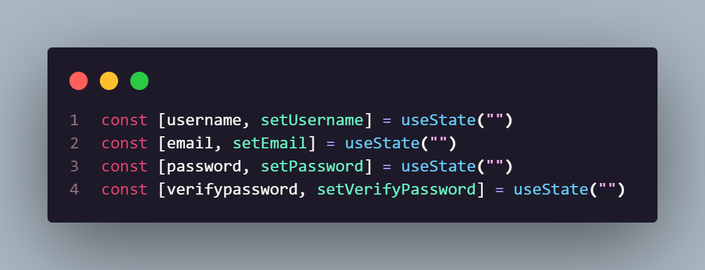
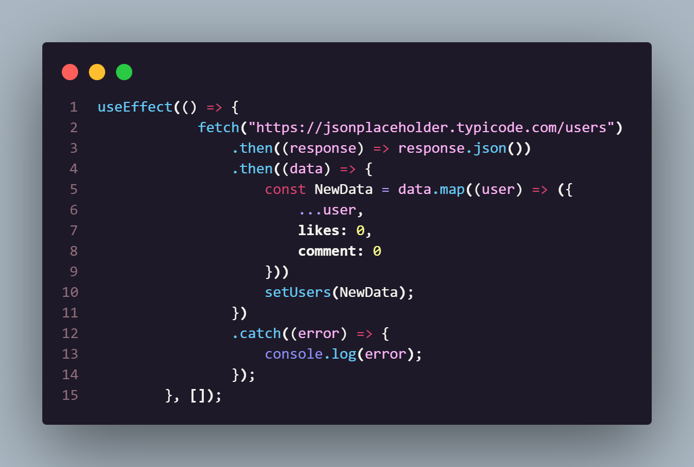
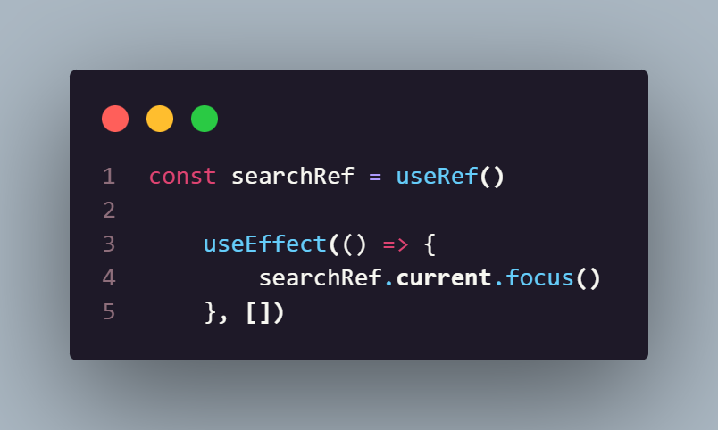
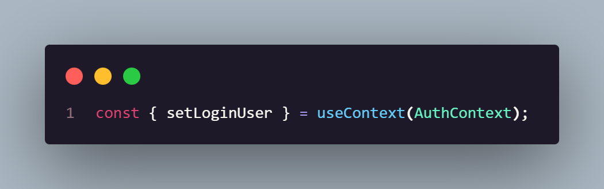

# SawitNet
Ini adalah website sosial media sederhana yaitu SawitNet. Website ini dibuat menggunakan React

## Login dan Sign Up
Website ini menggunakan **LocalStorage** sebagai media penyimpanannya. Jadi untuk masuk ke halaman home diharuskan untuk membuat akun terlebih dahulu lalu login.

## Component-Component
- Login : berisi halaman untuk login beserta fungsinya
- Sign Up : berisi halaman untuk daftar akun beserta fungsinya
- Home : berisi halaman home dan beberapa component seperti navbar, postcard, dan search
- Navbar : berisi component navbar yang bisa digunakan atau dipasang di halaman Home atau halaman lain
- Search : berisi component untuk mencari data atau akun pengguna berdasarkan input yang di berikan
- PostCard : berisi component untuk menampilkan postingan pengguna seperti jumlah likes, comment, nama, username, email, dan foto postingannya (saat ini isinya lorem ipsum)

## Fetch API
Untuk contoh data pengguna diambil melalui API dari [JSONPlaceholderAPI](https://jsonplaceholder.typicode.com/).

Cara Kerjanya:

- Saat halaman Home di render dia akan menjalankan fungsi **useEffect()** yang dimana isi dari fungsi ini berisi fetch
- Lalu dari fetch ini akan mengirimkan request ke API lalu API menjawab dengan berupa data.
- Kemudian data ini akan di ubah ke JSON karna data yang di terima berupa string sehingga harus di ubah ke JSON dengan **response.json()**
- Lalu karna di website ini memerlukan fitur likes maka data yang tadi sudah di dapat di modif agar like ini bisa tersimpan.
- Kemudian data yang sudah jadi ditampilkan di UI melalui component **PostCard**

## Implementasi React Hook

- **useState()** : Dipakai untuk menyimpan data **Akun**

- **useEffect()** : Dipakai untuk mengambil data user dari **API** ketika halaman Home dirender

- **useRef()** : Dipakai untuk memberikan fokus otomatis ke kolom input pencarian saat component **Search** dibuka

- **useContext()** : Dipakai untuk mengambil data user yang sedang login dari **AuthContext**

## Hasil Deploy
Untuk Hasilnya Bisa Di Lihat -> [Klik Disini](https://sosial-media-clone.vercel.app/)
